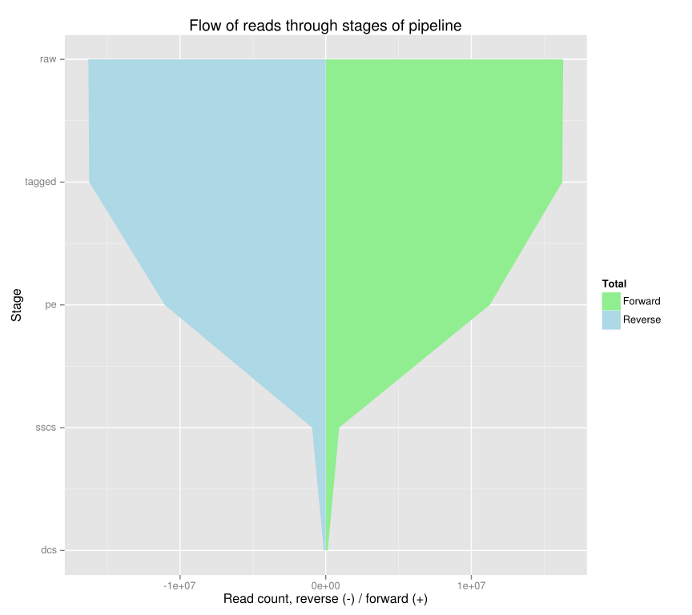

# Dwindling Reads

## Usage:

    dwindling-reads [--csv] ::: <stage1> <files> [::: <stage2> <files> [::: <stage3> <files>]
    dwindling-reads --help

This program collates summary information from a set of next-gen sequencing
paired-end reads at each stage of your pipeline.

Each stage is separated by three colons (:::), followed by two to four
arguments.  The first argument is an arbitrary name of your choosing to
identify that stage.  Both FastQ (uncompressed and gzipped) and BAM files are
supported.  FastQ stages must specify at least two files for forward and
reverse reads.  An optional third file may be specified for single-end orphans,
such as those commonly produced by quality trimmers.  BAM stages must specify
only a single .bam file.

CSV output may be piped into dwindling-plot to produce an SVG plot of the read
counts through the various stages.

## Options:

    --csv     output CSV instead of formatted text
    --help    print usage message and exit

## Examples:

    dwindling-reads ::: raw     raw/ABC_R1.fq.gz raw/ABC_R2.fq.gz \
                    ::: sickle  trimmed/ABC_R1.fq trimmed/ABC_R2.fq trimmed/ABC_orphans.fq \
                    ::: mapped  ABC.bam

## Example output:

    196300 raw = 98150 forward + 98150 reverse

    161640 sickle = 80820 forward + 80820 reverse (= 82.34% of raw)
      6278 single-end orphans (= 3.20% of raw)
     34660 discarded, including orphans (= 17.66% of raw)

    161910 mapped = 80820 forward + 80820 reverse (= 100.17% of sickle)
      -270 discarded (= -0.17% of sickle)

(In this case, bwa mem found 270 reads with secondary mappings so the reads
are growing not dwindling!)

## `dwindling-plot` example

# Installation

## `dwindling-reads`

Requires:

* Perl 5.14 or newer
* zcat (distributed with gzip)
* wc (distributed with coreutils)
* [samtools](http://htslib.org)

The first three are generally pre-installed on most Linux/Unix operating
systems.

In addition, several Perl libraries from [CPAN](http://cpan.org) are needed and
described in the `cpanfile`.  The quickest way to satisfy the Perl
prerequisites is by running:

    make bundle

from within a clone of the git repository.  This command will download
[cpanm](https://metacpan.org/pod/App::cpanminus) and use it to install the
required dependencies into the `inc/` directory.  The `dwindling-reads` program
will automatically use libraries in this directory if they exist.

## `dwindling-plot`

Requires:

* R 3.0.0 or newer
* [ggplot2](http://ggplot2.org/)
* [Cairo](http://www.rforge.net/Cairo/) R package

You can generally just install the two R packages like so:

    Rscript -e 'install.packages(commandArgs(T))' ggplot2 Cairo

To install them system-wide, use `sudo Rscript`.
